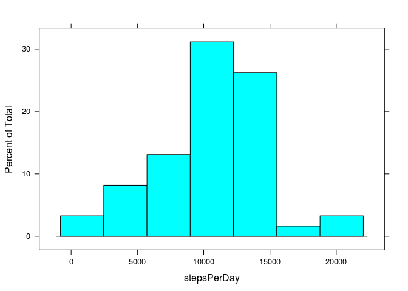
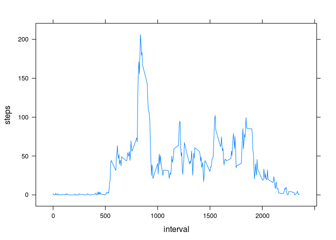
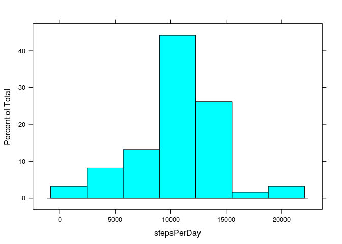
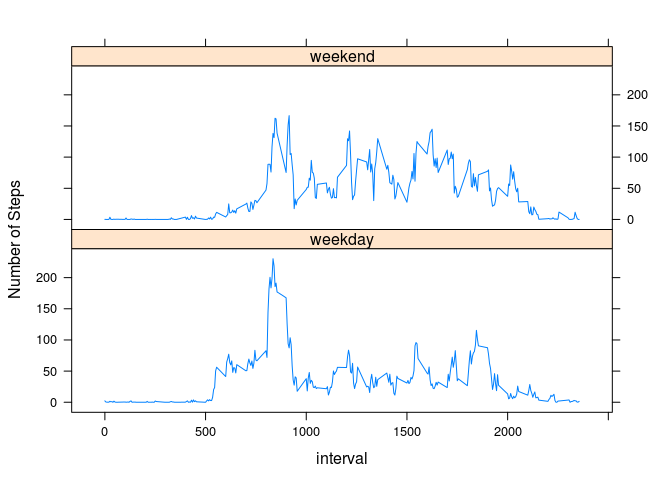

# Reproducible Research: Peer Assessment 1


## Loading and preprocessing the data


```r
data <- read.csv("activity.csv")
data$date <- as.Date(data$date, format="%Y-%m-%d")
```

## What is mean total number of steps taken per day?


```r
stepsPerDay<-tapply(data$steps, data$date, sum)

library(lattice)
histogram(stepsPerDay)
```

 

```r
meanval <- mean(stepsPerDay, na.rm=TRUE)
medianval <- median(stepsPerDay, na.rm=TRUE)
```

The mean is 1.0766189\times 10^{4} and the median is 10765

## What is the average daily activity pattern?


```r
avByTime <- aggregate(steps~interval, data, mean)
xyplot(steps ~ interval, avByTime, panel=panel.lines)
```

 

```r
maxStepsTime <- avByTime[which.max(avByTime$steps),"interval"]
```

The maximum number of steps occured at time period 835

## Imputing missing values

We will replace NAs with the average for that time interval.


```r
numNa <- sum(is.na(data$steps))
```
The number of NAs is 2304


```r
imputed<-data
imputed$steps<-ifelse(is.na(imputed$steps), 
                    avByTime[match(imputed$interval, avByTime$interval), "steps"], 
                    data$steps)

stepsPerDay<-tapply(imputed$steps, imputed$date, sum)

histogram(stepsPerDay)
```

 

```r
meanval <- mean(stepsPerDay, na.rm=TRUE)
medianval <- median(stepsPerDay, na.rm=TRUE)
```

The mean is 1.0766189\times 10^{4} and the median is 1.0766189\times 10^{4}

The mean is unchanged, but the median became the mean. 

In the histogram, the percentage of values at the median point increased. 
This makes sense because we are just adding in the average values to replace
the NAs.

## Are there differences in activity patterns between weekdays and weekends?


```r
imputed$weekday<-factor(ifelse(substr(weekdays(imputed$date), 1, 1) == "S", "weekend", 
                            "weekday"))
avByTime <- aggregate(steps~interval+weekday, imputed, mean)
xyplot(steps ~ interval|weekday, avByTime, panel=panel.lines, layout=c(1,2),
       ylab="Number of Steps")
```

 

